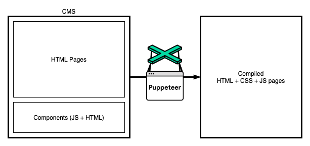
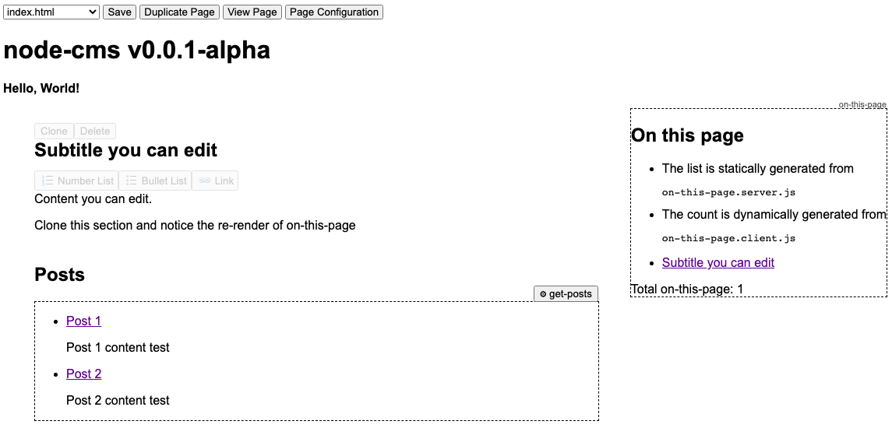

# codespace-cms

A light filesystem-orientated CMS that uses Puppeteer to generate static HTML pages into a dist folder.



Changes are saved back to your `siteRoot` directory. You can modify the pages in the `siteRoot` directory and those changes will be reflected in the CMS, and vica versa.

You can use Git for versioning, and the `outputRoot` folder that gets generated to deploy to a static server somewhere (you'll want to add the `outputRoot` folder to your `.gitignore` file).



## Using NPM

(TODO)

    npm install node-static-cms
    node-static-cms --siteRoot=(example-site) --outputRoot=(dist) --users.(admin)=(nodestaticcms)

## Development

### Installing and running

    npm install
    npm run dev (runs on localhost:3000/cms/index.html)
    npm run dev:generate (generates pages into dist/)

## Features

- Write straight to the src HTML (use Git for saving versions)
- Easy-to-make components with HTML + server-side JS and client-side JS
- In-place editing, giving you control as to what you'll allow an editor to touch

There is basic auth enabled out-the-box, but you should use a codespace.

### Does not have

- Image uploading, until it can be done properly

## Structure

You shouldn't need to touch the `lib` folder but I do encourage you to read it.

```
site structure:
    content-pages       (Pages go here)
    components          (Components go here)
    site-assets         (Static assets go here)
```

## Pages

(TODO)

- Must have a `<page-head>`
- Can use components that are made in the `components` directory automatically
- Any element that is content managed must have an `id`

## Components

- Must have a `.html` file
- Can have a `.server.js` file that will render statically when generating
- Can have a `.client.js` file that will run on the page like normal

## Globals

You can reference the `PAGE_DATA` object in your `.server.js` files to e.g. iterate through the pages list.

The `PAGE_DATA` object is not printed in the final output, so it won't work for `.client.js` files.

| Property               | Type                                                                                         | Description                                                                     |
| ---------------------- | -------------------------------------------------------------------------------------------- | ------------------------------------------------------------------------------- |
| `PAGE_DATA.components` | `Array<{FileNameAsTag: string, ServerScript: string \| null, ClientScript: string \| null}>` | `[{"FileNameAsTag":"file-name","ServerScript":"FileName","ClientScript":null}]` |
| `PAGE_DATA.pagesList`  | `Array<string>`                                                                              | Relative paths of pages from `src/content-pages`                                |
| `PAGE_DATA.siteAssets` | `Array<string>`                                                                              | Absolute paths of assets from `src/site-assets`                                 |
